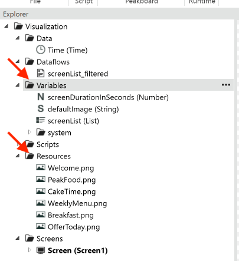

## How it works
This is a step by step guide on how to create your personal digital signage application with this template. For a general introduction to Peakboard, see the [first steps](https://peakboard.rocks/get-started). If you would like to know how to connect a Peakboard box to your designer and transfer a visualization, please read the following [article](https://peakboard.rocks/connect). To create a visualization you need the Peakboard Designer. This can be downloaded [for free](https://peakboard.com/en/peakboard-designer/?utm_source=templates_overview&utm_medium=description_link&utm_campaign=templates).

### Digital Signage with individual images
To replace the images in the template with the images you want to use, you need your own image files (PNG, JPG). Simply drag and drop the desired image files onto the left sidebar of the Peakboard Designer. Afterwards you will find the image files in the sidebar under 'Resources'. You can simply delete images that you do not need.

### Setting the variables
You can manage the visualization using the variables in the left sidebar of the Peakboard Designer. In the variable list 'screenList' you can define the display periods for each image. Enter the exact image name (incl. file extension) under 'Image (String)' and then define the start time under 'visible_from (String)' and the end time under 'visible_until (String)'.

Use the string variable 'defaultImage' to set a default image. This image is displayed if no other image is defined in the 'screenList' for the current time. Enter the exact name of your default image in the pop-up (including file extension).

If you want to change the default runtime of the images (10s), you can do so with the variable 'screenDurationInSeconds (Number)'. Click on the variable and set the number of seconds under 'Value'.

### Administration via the web interface
Alternatively, you can also manage the runtimes via the web interface, **if you already have a box**. This web interface is a web page that you can access by clicking on 'Manage / Upload' in the 'Home' tab of the Peakboard Designer. In the dialog, select the desired box (you must have already loaded the visualization onto a box). Now click on the button 'Web Interface'. You can learn more about the web interface [here](https://help.peakboard.com/misc/de-web.html). For the login, the login data delivered with the box are required. You will then see a screenshot of your currently running visualization and the variables on the right side. Click on the desired variable and adjust the value.

### Image credits
These are the links to the images used for the background of the visualization. https://unsplash.com/ is a very interesting project which offers a lot of free usable pictures in high quality. /photos/ykThMylLsbY, /photos/H5Hj8QV2Tx4, /photos/uVPV_nV17Tw, /photos/MqT0asuoIcU, /photos/5KS7T3Gs3CA, /photos/9J7sHieVFi0, /photos/8Nc_oQsc2qQ.