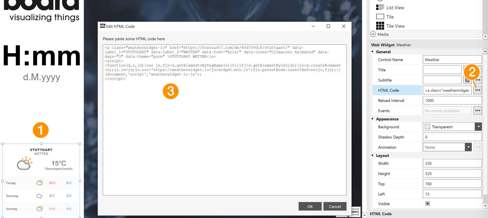

# possible data sources

The template was created using images and an Excel file in a OneDrive directory. Many other data sources are possible, such as Google Spreadsheet, RSS Feed, JSON, XML, CSV, OData, Web Services, REST API, Microsoft Excel, Google Docs, MS SharePoint Lists, Dropbox, Microsoft OneDrive, Google Drive, Microsoft,SharePoint Document Libraries, Microsoft Teams Files, a local file server and [more](https://peakboard.com/en/data-connections/).

# how it works

Find a general introduction to Peakboard [here](https://peakboard.rocks/get-started). If you want to know how to connect the Peakboard Designer to your Peakboard Box and how to transfer your visualization accordingly, the following [article](https://peakboard.rocks/connect) will help you. Download the [Peakboard Designer](https://peakboard.com/en/peakboard-designer/?utm_campaign=templates&utm_medium=description_link&utm_source=templates_overview) for free.

Download the files from [Github](https://github.com/Peakboard/peakboard-templates.github.io/tree/master/_templates/Digital-Bulletin-Board-With-OneDrive/data-files) to update the content of the template. Save the files in the desired location. You can store your files e.g. in one of the numerous cloud services offered. This way, they are always updated when you update the files in the respective cloud service. You can also add the files directly to the visualization by adding them to the Peakboard file.

If you want to change an image or the displayed PDF file, simply upload a file with the same name. The content of the new file will then be displayed. Below is an example of a OneDrive folder:

If you open the file board-contents.xlsx you will see two data sheets. Maintain your lunch menu data with the first sheet. Update the rows by adding new dates, the meal names and prices. The meals are displayed by the most current date.  Update the messages in the second sheet. The last five rows will always be displayed. This is what the Excel file looks like:

After you have placed the files in your desired folder and customized them accordingly, you can connect Peakboard to the files. Open this template in the Peakboard Designer and update the two data sources 'news_excel' and 'food_excel' under Data. Select the desired service and file and click on 'Load data'.

After you have closed this dialog and all required data sources and resources are updated, you should be able to see your data after pressing the 'Preview' button.

## weather widget update
If you do not want to use the weather widget, simply delete the element from the visualization in the Peakboard Designer by selecting it with a right-click and clicking on 'Delete'.

If you want to use the weather widget, create your own widget with your city at the following address: [https://weatherwidget.io/](https://weatherwidget.io/).

Specify the parameters like city, language and unit.

When satisfied with the options click on the button 'Get Code'. In the opened window you will now find the ready code for your personal widget. Copy this code by simply clicking on the button 'Copy to Clipboard'.

Now go back into the Peakboard Designer and select the control 'Web widget' in the sidebar or click directly on the weather widget.

In the sidebar on the right side you will find some parameters for this element. Click on the '...' button in the item 'HTML-Code' (2). In the opened window you can now replace the existing code with your own code (3).

## picture credits

The used images and graphics are from [Freepik](http://freepik.com/) and [Unsplash](https://unsplash.com/). 

- https://image.freepik.com/free-photo/three-starfishes-with-blue-bag-sand_23-2147952978.jpg
- https://image.freepik.com/free-photo/expression-spine-cut-out-injured-brown-hair_1134-954.jpg
- https://image.freepik.com/free-photo/stock-market-forex-trading-graph-graphic-concept_73426-172.jpg
- https://image.freepik.com/free-vector/network-mesh-wire-digital-technology-background_1017-27428.jpg
- https://image.freepik.com/free-psd/website-design-your-business_24972-394.jpg
- https://unsplash.com/photos/UCQCmt1i5ek
- https://unsplash.com/photos/bRdRUUtbxO0
- https://unsplash.com/photos/DVRXFIH42d0
- https://unsplash.com/photos/h5TDvTDwkBA
- Icons used in PDF [designed by Freepik](http://freepik.com/)