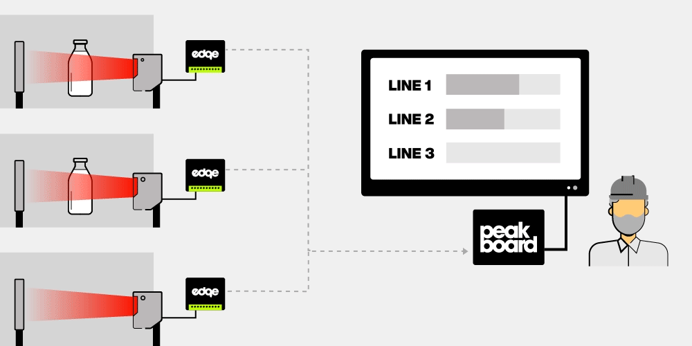

# possible data sources

This template uses the Peakboard Edge data source. Peakboard Edge can directly input and output information about external devices. Peakboard Edge does not communicate via a display, but is always connected to a Peakboard Box. [Here you can learn more about Peakboard Edge](https://peakboard.com/produkt/peakboard-edge/).

As an alternative to Peakboard Edge, the status of the individual filling lines could also be obtained via machine protocols such as MQTT, OPC UA, Siemens S7, Werme, Mitsubishi Electric or via an MES. The following MES, among others, are supported: FASTEC 4 PRO, FORCAM FORCE, DELMIA Apriso MES and [many more] (https://peakboard.com/en/product/peakboard-versions/#dataconnections).

# how it works

