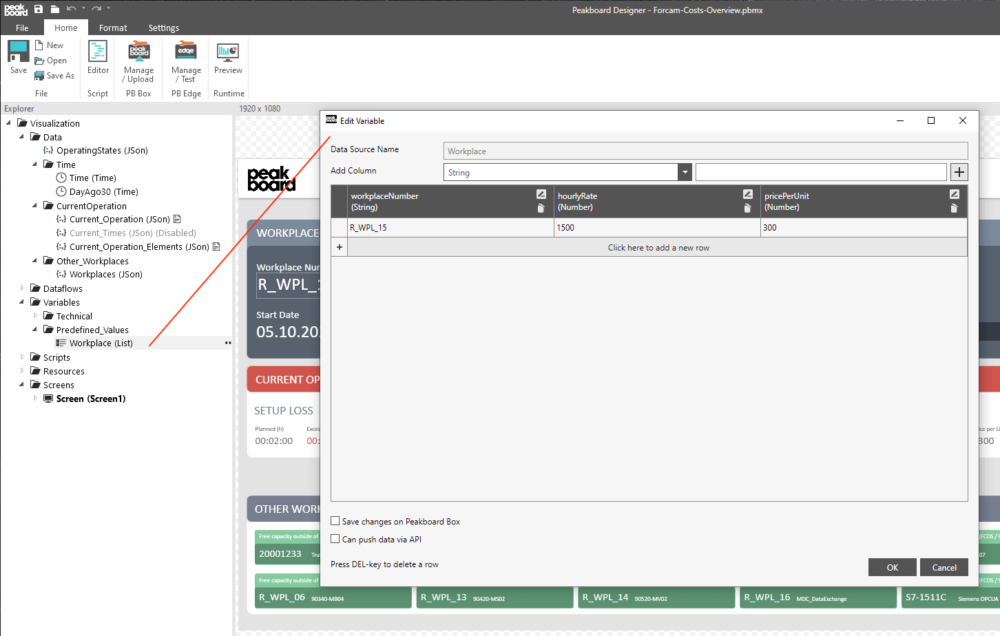

# So funktioniert's

Um dieses Board mit deinem Forcam System zu verbinden musst du erst die URLs der JSON Calls and die Forcam API anpassen. Dies musst du für alle 5 Calls wiederholen.

Anschließend musst du die Authentifizierung anpassen. Gib jeweils deine URL an und deine Client ID und deinen Client Secret. Wenn du noch weitere Calls an die ForceBridge API machen willst kannst du immer das Forcam Preset verwenden.

Anschließend kannst du noch ein paar Parameter anpassen. Zum einen musst du angeben, welchen Workplace du anzeigen lassen willst und zum anderen musst du noch angeben was der Stundensatz deiner Maschine oder deines Workplaces ist und weiß ein einzelnes Teil kostet. Diese Werte könnten natürlich auch aus einem anderen System gezogen werden. Hier wird es mit einfachen Variablen simuliert.

Mit Hilfe eines Touchscreens oder Maus und Tastatur kann die Workplace Number auf im laufenden Betrieb getauscht werden um so flexibel unterschiedliche Workplaces betrachten zu können. Einfach das Textfeld anklicken, die neue Workplace Number eintragen und anschließend auf den Button klicken zum bestätigen. Wenn du diese Funktion nicht benötigst, einfach den Button entfernen und aus dem Eingabefeld ein normales Textfeld machen.

