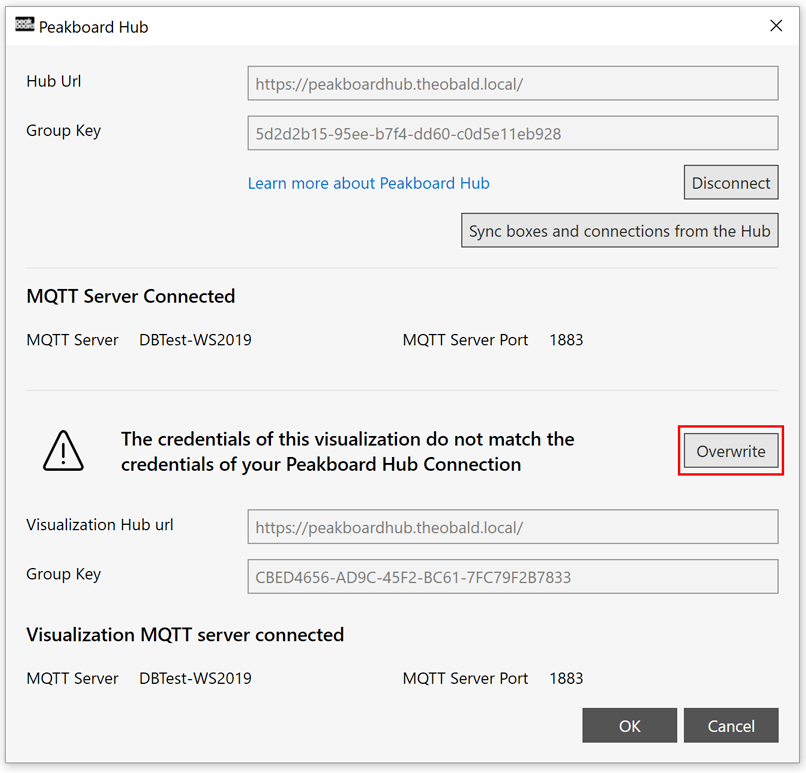

# possible data sources
This template used a Peakboard Hub list as the central data source. Here, the data in the Peakboard Hub list is collected through [this](https://templates.peakboard.com/Interactive-Board-Manual-Quality-Control/en) interactive dashboard. Alternatively, other databases such as SQL, Oracle or ODBC can be used for this purpose.

# how it works
To be able to use this template to its full extent, you need Peakboard Hub. You can find out how to install it [here](https://help.peakboard.com/hub/de-hub_installation.html). Open Peakboard Hub, select "Lists" in the menu and click on the "Import" button to import the required table structure. You can download it <a href="QualityData.txt" class="inline" download>here</a>.

Fill in the "Name" field with "QualityData" and select the previously downloaded file.

 
 Next, open the Peakboard Designer and setup a connection to Peakboard Hub as explained [here](https://help.peakboard.com/hub/de-hub_connectpbdesigner.html). Now open this template within the Peakboard Designer and go back to the Peakboard Hub settings under Project > Peakboard Hub.

 

Click on "Overwrite" to replace the Peakboard Hub Connection of the template with your own credentials.

 

 Now you are ready and the template automatically reads data from the created list in Peakboard Hub.
