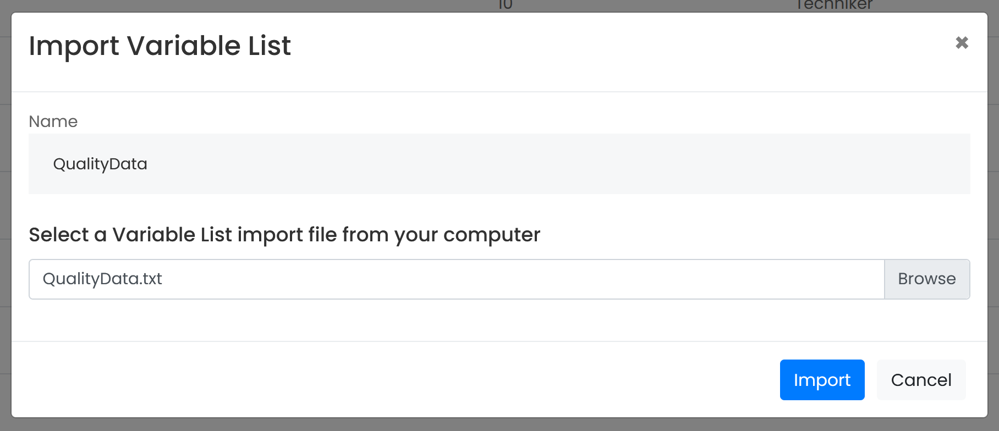
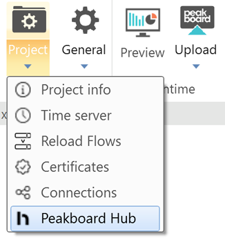

# mögliche datenquellen
Dieses Template verwendeten eine Peakboard Hub Liste als zentrale Datenquelle. Die Daten, die mithilfe des Touchscreens erfasst werden, werden dabei in eine Peakboard Hub Liste geschrieben, die dann für die Datenvisualisierung ausgelesen wird. Alternativ können hierfür andere Datenbanken wie SQL, Oracle oder ODBC genutzt werden.

# so funktioniert's
Um dieses Template vollumfänglich nutzen zu könnten, benötigst du den Peakboard Hub. Wie du diesen installierst, erfährst du [hier](https://help.peakboard.com/hub/de-hub_installation.html). Öffne den Peakboard Hub, wähle im Menü “Lists” und klicke auf den "Import" Button um die benötigte Tabellenstruktur zu importieren. Diese kannst du hier <a href="QualityData.txt" class="inline" download>hier</a> herunterladen. 

Das Feld "Name" solltest du mit “QualityData” ausfüllen und darunter die zuvor heruntergeladene Datei selektieren.

 Öffne nun den Peakboard Designer und stelle wie [hier](https://help.peakboard.com/hub/de-hub_connectpbdesigner.html) erklärt, eine Verbindung zum Peakboard Hub her. Öffne nun dieses Template im Peakboard Designer und gehe erneut in die Peakboard Hub Einstellungen unter Projekt/Project > Peakboard Hub.

 

Klicke auf den “Überschreiben/Overwrite” Button um die Hub Connection des Templates mit deinen eigenen Anmeldedaten zu überschreiben.

 

 Nun ist alles Bereit und das Template schreibt die erfassten Daten in die angelegte Liste im Peakboard Hub.
