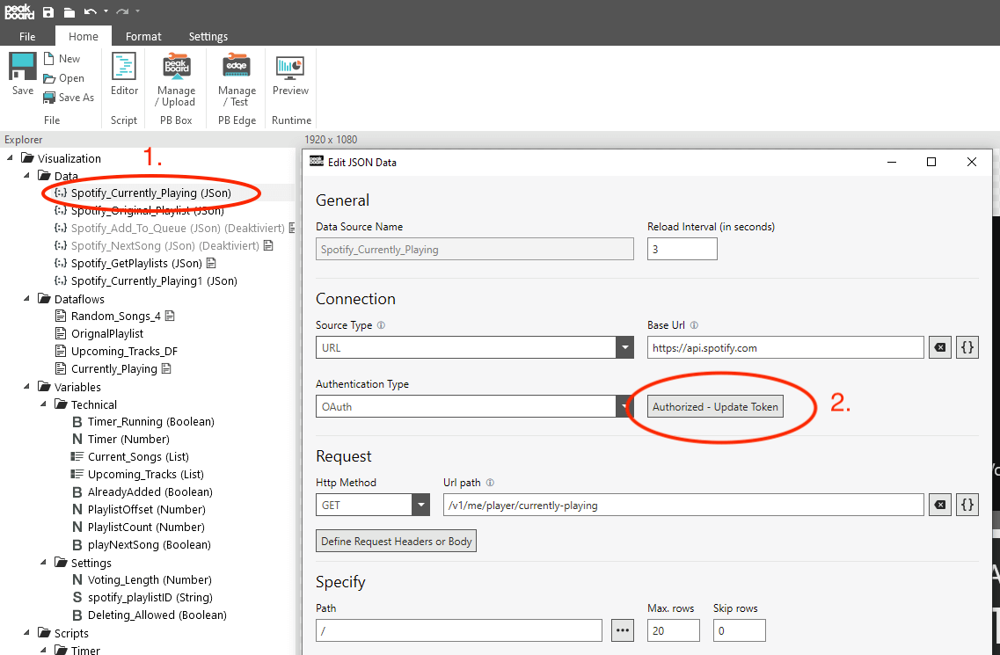
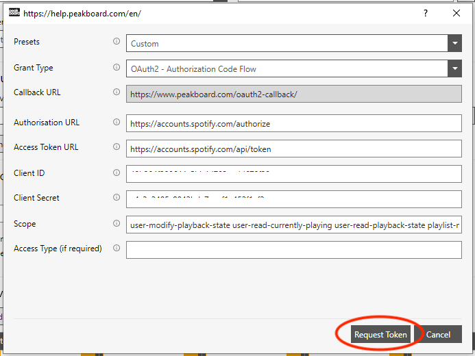

# how it works

Download the template and open it with the Peakboard Designer.
Now you first have to authenticate yourself to Spotify. You do this by opening a data source (1.) and renewing the token there. Click on the button 'Renew Token' (2.) to open all settings concerning OAuth authentication. 

Now click on 'Request Token' in the dialog.

Afterwards you have to login to your Spotify account.

Now you are done and the template is connected to your Spotify.

Now open Spotify on your computer or phone and run any song. The music is not transmitted via Peakboard, Peakboard only works as a kind of remote control.

If you start the visualization now in the preview or on a peakboard box you can start directly with a touchscreen or a mouse.

Now select a playlist you want to use as a base for your jukebox. Afterwards, 4 songs from this playlist are always displayed randomly and transferred to the right column after a time period.

And this is how your jukebox works. There are always 4 random songs. And the guests of your party can vote for the songs (1). At the end of the voting time, which you can adjust (2) or when you press 'Done' (3), the song with the most votes is transferred to the 'Next Up' column (4). If there are no votes or if there is a tie the first song is always transferred. These are the songs that are now running one by one. Shortly before the end of a song the top song of this list is always transferred to your Spotify Queue. If you don't like any of the songs you can load four new songs (5) or even change the playlist (6). You can also skip the current song (7). So nothing stands in the way of an interactive party playlist.